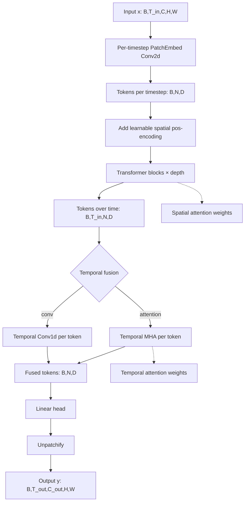

# ViT Nowcasting Architecture

## Overview

Vision Transformer (ViT) adapted for weather nowcasting with temporal fusion.

## High-Level Diagram



## Architecture Components

### 1. Patch Embedding
```
Input: (B, C, H, W)
Conv2d(C_in, embed_dim, kernel=patch_size, stride=patch_size)
Output: (B, N, D) where N = (H/P) × (W/P)
```

**Design Choice**: Conv-based embedding (standard ViT) vs linear projection
- Conv is faster and maintains spatial locality in initialization
- Patch size determines resolution-computation tradeoff

### 2. Positional Encoding
- Learnable 2D positional embeddings
- Shape: `(1, N, D)` broadcast to batch
- Initialized with truncated normal (std=0.02)

### 3. Transformer Blocks
```
for each block:
    x = x + Attention(LayerNorm(x))
    x = x + MLP(LayerNorm(x))
```

**Components**:
- **LayerNorm**: Pre-norm architecture (more stable training)
- **MHA**: Multi-head self-attention with optional weights
- **MLP**: 2-layer FFN with GELU activation
  - Hidden dim = `embed_dim × mlp_ratio` (default 4×)

### 4. Temporal Fusion

**Option A: Temporal Attention** (default)
```
tokens: (B, T_in, N, D) → reshape → (B×N, T_in, D)
MHA over time dimension
Mean pool → (B, N, D)
```
- Provides interpretable temporal attention weights
- Learns which input timesteps are most relevant

**Option B: Temporal Convolution**
```
Conv1d(D, D, kernel=3, padding=1) over time
Mean pool → (B, N, D)
```
- Faster, no attention overhead
- Less interpretable

### 5. Output Head
```
Linear(D, T_out × P² × C_out)
Unpatchify: (B, N, T_out×P²×C_out) → (B, T_out, C_out, H, W)
```

## Computational Complexity

### Time Complexity
| Operation | Complexity |
|-----------|------------|
| Patch Embed | O(B × C × H × W) |
| Spatial Attention | O(B × T × N² × D) |
| Temporal Attention | O(B × N × T² × D) |
| MLP | O(B × T × N × D²) |
| Output Head | O(B × N × D × T_out × P²) |

**Total**: O(B × T × N² × D × L) where L = depth

### Memory Complexity
| Component | Memory |
|-----------|--------|
| Activations | O(B × T × N × D × L) |
| Attention matrices | O(B × H × N² × L) for spatial |
| Model parameters | O(D² × L + D × P² × C) |

### Scaling Recommendations

| Image Size | Patch Size | Tokens | Recommended Config |
|------------|------------|--------|-------------------|
| 64 | 8 | 64 | depth=4, dim=256 |
| 128 | 16 | 64 | depth=4, dim=256 |
| 256 | 16 | 256 | depth=4-6, dim=256 |
| 256 | 8 | 1024 | depth=2-4, dim=128 (memory!) |
| 512 | 32 | 256 | depth=6, dim=384 |

## Efficient Attention

The implementation supports PyTorch's optimized attention:
- **Flash Attention**: Automatically used when available (PyTorch 2.0+)
- **Memory Efficient**: Falls back to standard attention when extracting weights

```python
# Production mode (no attention extraction)
output, _ = model(x, return_attn=False)  # Uses Flash Attention

# Interpretability mode
output, extras = model(x, return_attn=True)  # Standard attention
spatial_attn = extras["spatial_attn"]  # (T_in, B, heads, N, N)
temporal_attn = extras["temporal_attn"]  # (B, heads, T_in, T_in)
```

## Interpretability

### Spatial Attention Analysis
```python
# Average over heads, sum over queries → token importance
importance = spatial_attn.mean(dim=0).sum(dim=-2)  # (N,)
grid = importance.reshape(H//P, W//P)  # Attention heatmap
```

### Temporal Attention Analysis
```python
# Which input timesteps contribute most?
temporal_attn.mean(dim=1)  # (T_in, T_in) matrix
```

## Configuration Reference

```yaml
model:
  image_size: 256      # Input resolution
  patch_size: 16       # Patch size (8, 16, 32)
  embed_dim: 256       # Token dimension
  depth: 4             # Number of transformer blocks
  num_heads: 8         # Attention heads (embed_dim % num_heads == 0)
  mlp_ratio: 4.0       # MLP hidden dim multiplier
  dropout: 0.1         # Dropout rate
  attn_dropout: 0.0    # Attention dropout
  temporal_fusion: attention  # "attention" or "conv"
  temporal_heads: 4    # Heads for temporal attention
  t_out: 2             # Output timesteps
```

## Implementation Files
- Model: `src/models/vit_nowcasting.py`
- Training: `src/train/train_vit.py`
- Ablations: `src/train/run_ablation.py`
- Configs: `configs/ablation/`
- Visualization: `src/eval/visualize.py`
